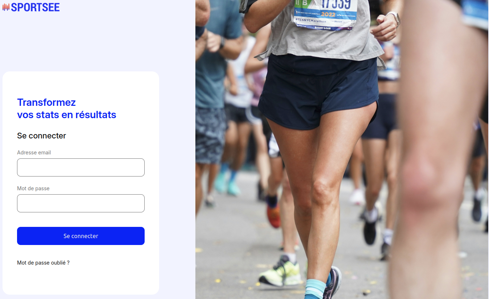
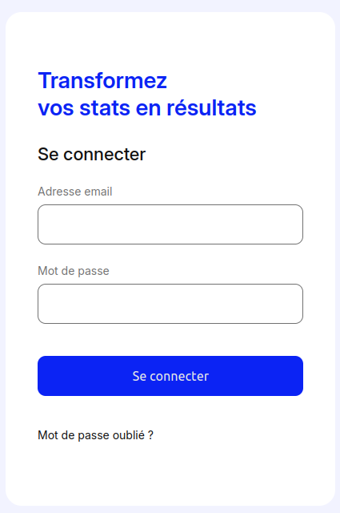
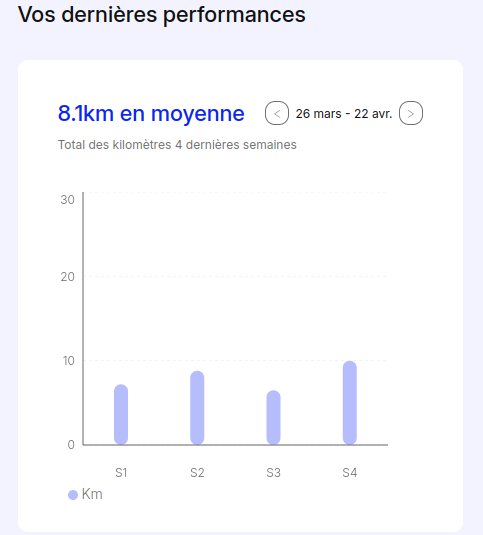

# Projet 6 : SportSee

## _OpenClassrooms_

_Par André M._

---

## Contexte

Développement de la nouvelle version de la page profil utilisateur de **SportSee**, une startup dédiée au coaching sportif.

- **Objectif principal** : Développer un tableau de bord d'analytics avec React et Recharts.

---

## Mise en place de l'application

- `npx create-react-router@latest`: création du projet avec React Router V7
- [mock](https://github.com/nutbreaker/projet_6/tree/main/frontend/mocks) : données de mock
- [vite.config.js](https://github.com/nutbreaker/projet_6/blob/main/frontend/vite.config.js) : configuration du serveur de mock
- [Dockerfile](https://github.com/nutbreaker/projet_6/blob/main/frontend/Dockerfile) : contenarisation du frontend
- [docker-compose.yml](https://github.com/nutbreaker/projet_6/blob/main/docker-compose.yml) : lance de projet en mode dev (serveur mock) ou prod (serveur API) en fonction du profil

---

## Architecture du projet

- [routes.js](https://github.com/nutbreaker/projet_6/blob/main/frontend/app/routes.js) : routeur de l'application
- [root.jsx](https://github.com/nutbreaker/projet_6/blob/main/frontend/app/root.jsx) : racine du projet
- [utils](https://github.com/nutbreaker/projet_6/tree/main/frontend/app/utils) : fonctions utilitaires
- [services](https://github.com/nutbreaker/projet_6/tree/main/frontend/app/services) : logique d'accès à l'API
- [routes](https://github.com/nutbreaker/projet_6/tree/main/frontend/app/routes) : routes de l'application
- [hooks](https://github.com/nutbreaker/projet_6/tree/main/frontend/app/hooks) : accès au données de l'API
- [components](https://github.com/nutbreaker/projet_6/tree/main/frontend/app/components) : composant visuel de l'application
- [_layout](https://github.com/nutbreaker/projet_6/tree/main/frontend/app/_layout) : base commune de [dashboard.jsx](https://github.com/nutbreaker/projet_6/blob/main/frontend/app/routes/dashboard.jsx) et [profile.jsx](https://github.com/nutbreaker/projet_6/blob/main/frontend/app/routes/profile.jsx)

---

## Routing avec React Router

### Navigation et accès

- Routes créées pour les différentes vues : Connexion, Tableau de bord, Profil, et une page [404](https://github.com/nutbreaker/projet_6/blob/59ccf4709afdeb0901c3fc5f6414280658f353f9/frontend/app/root.jsx#L56-L66) personnalisée
- **Sécurité** : 
  - La page de connexion est publique
  - Les autres routes sont privées et redirigent vers la connexion si l'utilisateur n'est pas authentifié

---

## Gestion de l'état avec Context API

### Partage des données

- Mise en place d'un [contexte](https://github.com/nutbreaker/projet_6/blob/59ccf4709afdeb0901c3fc5f6414280658f353f9/frontend/app/_layout/layout.jsx#L37) global pour gérer l'état de l'application
- Le contexte ne contient que les [données strictement nécessaires](https://github.com/nutbreaker/projet_6/blob/59ccf4709afdeb0901c3fc5f6414280658f353f9/frontend/app/routes/dashboard.jsx#L15) au partage entre les composants, évitant ainsi la surcharge

---

## Authentification et Sécurité

### Connexion utilisateur

- Formulaire fonctionnel utilisant les identifiants fournis
- Le **token JWT** est stocké de manière sécurisée* et inclus dans les [en-têtes](https://github.com/nutbreaker/projet_6/blob/59ccf4709afdeb0901c3fc5f6414280658f353f9/frontend/app/services/apiClient.js#L14-L18) des requêtes HTTP

*\* La sécurité est relative*

---

## Intégration des graphiques avec Recharts

### Visualisation des données

- Utilisation de **Recharts** pour tous les graphiques
- Les graphiques correspondent aux maquettes Figma
- L'affichage est optimisé pour du 1024x780 pixels

---

## Difficultés rencontrées

- API très inconsistante
  - [profilePicture](https://github.com/OpenClassrooms-Student-Center/P6JS/blob/a2eb23cb0a6c99a257f77203cd2b030021ca03d7/app/data.json#L10) màj côté front lors que l'application est déployée sur un serveur
  - [weeklyGoal](https://github.com/OpenClassrooms-Student-Center/P6JS/blob/a2eb23cb0a6c99a257f77203cd2b030021ca03d7/app/data.json#L4) vs [goal](https://github.com/OpenClassrooms-Student-Center/P6JS/blob/a2eb23cb0a6c99a257f77203cd2b030021ca03d7/app/data.json#L370), oblige une [valeur](https://github.com/nutbreaker/projet_6/blob/59ccf4709afdeb0901c3fc5f6414280658f353f9/frontend/app/services/fetchWeekGoal.js#L16) par défaut
  - [username](https://github.com/OpenClassrooms-Student-Center/P6JS/blob/a2eb23cb0a6c99a257f77203cd2b030021ca03d7/app/routes.js#L29) maquette requiert une addresse e-mail
- Documentation de Recharts compliquée à naviguer

---

## Conclusion

 N'abandonnez pas vos rêves, continuez à dormir.
